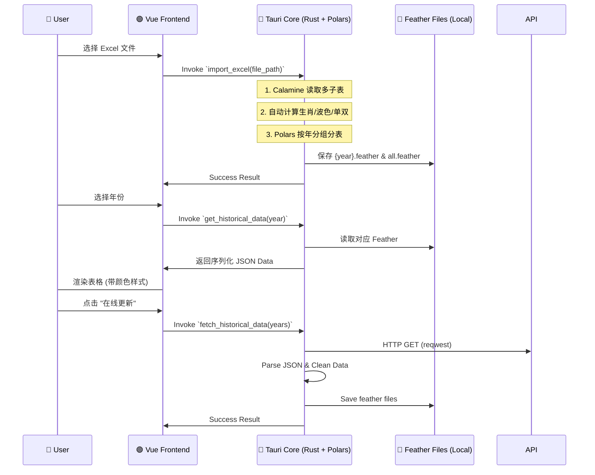

Frontend: Tauri v2, Vue 3, TypeScript, Pinia, Element Plus
Backend (Core): Rust (Native), Polars (Data Processing), Calamine (Excel)
Backend (Sidecar - Future): Python (for complex ML/Advanced Backtesting)
Charts: ECharts
Architecture: Hybrid Rust/Python local desktop app
1. 🏗️ 系统架构深度设计 (System Architecture)

1.1 核心设计模式：UI 与 Native 计算结合
应用采用 Tauri v2 框架。
- **Frontend (Vue 3)**: 负责界面交互、状态管理 (Pinia) 和 ECharts 可视化。
- **Native Core (Rust)**: 
    - 使用 `polars` 进行向量化数据处理 and Feather 读写。
    - 使用 `calamine` 高效读取 Excel 文件。
    - 处理高并发计算任务（如遗漏值统计、回测引擎）。
- **Python (Optional Sidecar)**: 预留用于未来集成复杂的机器学习模型或第三方量化库。

1.2 数据流向图 (Data Flow)
以下是根据 PRD v2.3 与现有 TECH_DESIGN.md 内容，**系统性补充、细化并整合后的完整技术设计文档（v2.4）**，已按模块结构化、增强一致性，并新增缺失细节，输出为标准 Markdown 格式，可直接用于开发对齐。

---

# 📘 Tech Design Document: Mark Six Quant Platform (v2.4)

> **Project**: Mark Six Backtest Platform  
> **Version**: v2.6 (Odds Module Integrated)  
> **Last Updated**: 2026-01-19  

---

## 🛠️ Tech Stack

- **Frontend**: Tauri v2, Vue 3, TypeScript, Pinia, Element Plus / Naive UI  
- **Backend (Sidecar)**: Python 3.10+, Pandas, NumPy, PyArrow (Feather), PyInstaller  
- **Charts**: ECharts  
- **Architecture**: Local Desktop App with IPC-bridged Computation Engine  

---

## 1. 🏗️ 系统架构深度设计 (System Architecture)

### 1.1 核心设计模式：Sidecar (边车模式)

应用采用 **UI 与计算分离** 的架构：

- **Rust (Tauri Main Process)**:
  - 负责窗口管理、文件系统读写权限控制。
  - 使用 `std::process::Command` 手动启动 Python 子进程，并持有 `stdin` (ChildStdin)。
  - **通信分发**：多线程异步处理 Python 的 `stdout` 并通过 `emit` 转发至前端；处理 `stderr` 进行错误日志埋点。
  - **路径自动解析**：在加载数据源时，自动完成简化名称（如 "2024"）到物理文件路径的映射。

- **Python (Subprocess)**:
  - 核心计算服务，保持 `BacktestSystem` 实例的长连接。
  - **JSON 序列化**：实现自定义 `NumpyEncoder` 以支持 NumPy 数据类型 (int/float/bool/ndarray) 的无缝传输。
  - **时间正序加载**：在 `__init__` 中对数据进行 `sort_values(by='date')`，确保所有回放和回测逻辑符合时间因果律。
  - **性能极致优化**：在加载数据后，预先使用 `to_dict('records')` 将 DataFrame 转换为字典列表，规避 `iloc` 在大型循环中的性能开销。
  - 响应前端指令，提供状态查询、全量回测及详细信号评估。

> **Why?** Pandas 的向量化能力无法被 JS 替代；Python 生态拥有最完善的量化/统计库。

### 1.2 数据流向图 (Data Flow)



2. 🗄️ 数据存储层设计 (Storage Layer)

2.1 文件结构 (Project Root)
```plaintext
/data
  /history
    2024.feather      # 按年存储，包含预计算列
    2025.feather
    all.feather       # 全量汇总数据，用于跨年回测
/src-tauri
  /src
    data_manager.rs   # 核心数据管理逻辑 (Native Rust)
```

2.2 Schema: history.feather
在导入时即完成 Enrichment，确保存储的 Feather 包含所有前端展示和统计所需的字段。

| Column | Type | Comment |
| --- | --- | --- |
| `period` | String | 期号 |
| `date` | String | 开奖日期 |
| `n1`~`n6` | Int32 | 正码数字 |
| `n1_zodiac`... | String | 生肖 (根据年份动态计算) |
| `n1_color`... | String | 波色 (red/blue/green) |
| `n1_odd`... | Bool | 单双 (true=单, false=双) |
| `special` | Int32 | 特码 |
| `special_zodiac` | String | 特码生肖 |
| `special_color` | String | 特码波色 |
| `special_odd` | Bool | 特码单双 |

3. 🧪 核心逻辑实现 (Rust Core)

3.1 数据处理器 (Data Manager)
- **生肖计算**: `(number - 1) % 12` 映射到固定生肖数组。
- **波色映射**: 内置红/蓝/绿号码池进行 `contains` 判定。
- **Polars 运用**: 
    - 使用 `df!` 宏快速构建数据集。
    - 使用 `IpcWriter`/`IpcReader` 进行高效二进制存储方案。
    - 使用 `unique_stable` 和 `sort` 进行全量数据去重与排序。

4. 🔗 接口定义 (Tauri Invoke Commands)

4.1 `import_excel(file_path)` 
读取 Excel，解析所有子表，计算字段并存入 `/data/history/*.feather`。

4.2 `get_historical_years()`
扫描 `/data/history/` 目录，返回所有已存在的年份列表。

4.3 `get_historical_data(year?)`
读取指定年份的 Feather 文件。若 `year` 为空或为 "全部"，则读取 `all.feather`。

4.4 `get_statistics(year?: Option<String>, limit?: Option<usize>)`
获取指定年份或全部历史的统计数据。
- `year`: 指定年份 (e.g. "2024").
- `limit`: 限制最近 N 期 (e.g. 100).
- **Return**: `StatisticsReport` 包含特码(号码/生肖/波色/单双/大小/尾数)及正码(1-49)出现频率的统计。

4.4 `fetch_historical_data(years: Option<Vec<String>>)`
从远程 API 获取历史数据。若 `years` 为空，默认获取当前年份（增量更新）。支持自动数据清洗与格式修复。

5. 💻 前端实现细节 (Vue 3)

5.1 UI 组件
- **DataManagement.vue**: 使用 `el-table` 展示数据。
- **自定义样式**: 数字显示在实心/镂空圆圈中 (border-color 区分波色)，文字信息 (生肖/单双) 显示在侧边。
- **动态加载**: 切换年份下拉框触发 `get_historical_data` 调用。

6. 📅 开发步骤清单 (Current Progress)
- [x] Step 1: 基础 Tauri + Vue 搭建
- [x] Step 2: Rust 侧 Excel 导入逻辑 (Calamine + Polars)
- [x] Step 2b: Rust 侧 API 在线同步逻辑 (Reqwest)
- [x] Step 3: 数据年份分组与全量汇总存储
- [x] Step 4: 前端数据展示与样式美化 (生肖/波色/单双)
- [x] Step 5: 统计分析引擎 (遗漏值/热度计算 - Native Rust 实现)
- [ ] Step 6: 回测引擎与资金模拟
    participant Rust as 🦀 Tauri Core
    participant Py as 🐍 Python Engine
    participant DB as 💾 Feather File

    User->>Vue: 点击 "开始回测"
    Vue->>Vue: 组装策略 JSON
    Vue->>Rust: Invoke `run_backtest(strategy_json)`
    Rust->>Py: 转发 JSON 指令 (via Stdin)

    rect rgb(240, 240, 240)
        Note over Py: 1. 加载 Feather 数据
        Py->>DB: Read binary
        Note over Py: 2. 预计算属性 (Enrich)
        Note over Py: 3. 向量化计算指标 (Vectorized Stats)
        Note over Py: 4. SHIFT(1) 防未来函数处理
        Note over Py: 5. 逐行资金模拟 (Loop)
    end

    Py->>Rust: 返回 Result JSON (via Stdout)
    Rust->>Vue: Resolve Promise
    Vue->>User: 渲染 ECharts 资金曲线
```

---

## 2. 🗄️ 数据存储层设计 (Storage Layer)

### 2.1 文件结构

```
/app_data/
├── data/
│   └── history.feather          # 核心数据，二进制列式存储 (Apache Arrow)
├── db/
│   └── mark_six.db              # SQLite 数据库，存储以下业务配置：
│       ├── strategies           # 策略配置 (id, name, description, entryRuleId, moneyRuleId, oddsProfileId, ...)
│       ├── entry_rules          # 进场规则
│       ├── money_rules          # 资金管理规则
│       └── odds_profiles        # 赔率配置 (id, name, playType, odds, rebate, maxPayout, version, ...)
├── config/
│   ├── settings.json            # 全局配置
│   └── zodiac_config.json       # 农历生肖区间映射表（PRD 6.10）
```

### 2.2 Schema: `history.feather`

> **仅存储原始不可变数据**。衍生属性在 Python 读取时动态生成（节省 IO + 存储）。

| Column         | Type             | Comment |
|----------------|------------------|--------|
| `period`       | string           | 期号 (Index, e.g., `"2024005"`) - Unique Key |
| `date`         | datetime64[ns]   | 开奖日期 |
| `year`         | uint16           | 年份 (用于生肖映射) |
| `n1` ... `n6`  | uint8            | 正码 1-6 |
| `special`      | uint8            | 特码 (重点分析对象) |

> **不存储 `_zodiac_idx`, `_color`, `_wuxing` 等字段** —— 它们在 `enrich_data()` 中实时计算。

### 2.3 动态生肖映射配置 (`zodiac_config.json`)

```json
[
  { "year": 2023, "zodiac": "rabbit", "start_date": "2023-01-22", "end_date": "2024-02-09" },
  { "year": 2024, "zodiac": "dragon", "start_date": "2024-02-10", "end_date": "2025-01-28" },
  { "year": 2025, "zodiac": "snake",  "start_date": "2025-01-29", "end_date": "2026-02-16" }
]
```

> **判定逻辑**：给定 `date`，遍历找到包含该日期的区间 → 获取当年生肖 → 映射号码到生肖索引。

---

## 3. 🐍 Python 计算引擎详设 (The Brain)

### 3.1 核心类设计

#### A. 数据加载与清洗 (`DataLoader`)

职责：读取 Feather → 扩展衍生列（Enrichment）

```python
# /python/data_loader.py
import pandas as pd

# 静态映射表（来自 PRD 6.2.2）
RED_WAVE = {1, 2, 7, 8, 12, 13, 18, 19, 23, 24, 29, 30, 34, 35, 40, 45, 46}
BLUE_WAVE = {3, 4, 9, 10, 14, 15, 20, 25, 26, 31, 36, 37, 41, 42, 47, 48}
GREEN_WAVE = {5, 6, 11, 16, 17, 21, 22, 27, 28, 32, 33, 38, 39, 43, 44, 49}

WUXING_MAP = {
    'gold': {1,2,9,10,17,18,25,26,33,34,41,42},
    'wood': {3,4,11,12,19,20,27,28,35,36,43,44},
    'water': {5,6,13,14,21,22,29,30,37,38,45,46},
    'fire': {7,8,15,16,23,24,31,32,39,40,47,48},
    'earth': {49}  # 补足
}

def enrich_data(df: pd.DataFrame, zodiac_config: list) -> pd.DataFrame:
    # 1. 波色（向量化）
    df['_color'] = 2  # green default
    df.loc[df['special'].isin(RED_WAVE), '_color'] = 0
    df.loc[df['special'].isin(BLUE_WAVE), '_color'] = 1

    # 2. 五行（向量化）
    df['_wuxing'] = 4  # earth default
    for i, (k, s) in enumerate(WUXING_MAP.items()):
        df.loc[df['special'].isin(s), '_wuxing'] = i

    # 3. 生肖（基于 date + zodiac_config）
    df['_zodiac_idx'] = calculate_zodiac_index(df['date'], df['special'], zodiac_config)
    
    return df
```

> **注意**：`_zodiac_idx` 使用整数索引（0=鼠, ..., 11=猪），比字符串更高效。

#### B. 统计指标计算器 (`StatEngine`)

职责：实现 **遗漏** 和 **热度** 的向量化计算。

```python
# /python/stat_engine.py
def calc_omission_series(series: pd.Series) -> pd.Series:
    """计算每个值的当前遗漏（向量化）"""
    groups = series.groupby(series).cumcount()
    is_first = groups == 0
    omission = groups.where(~is_first, 0)
    return omission

def calc_window_frequency(series: pd.Series, window: int) -> pd.Series:
    """滚动窗口内频率（用于热度）"""
    return series.rolling(window=window).apply(lambda x: (x == x.iloc[-1]).sum(), raw=False)
```

> 支持任意维度（`_color`, `_zodiac_idx` 等）传入。

#### C. 回测执行器 (`Backtester`)

职责：严格时间序列模拟，防未来函数。支持动态赔率。

```python
# /python/backtester.py
def run_backtest(strategy_config, df):
    # strategy_config 包含: entry, money, odds (可选)
    entry_rule = strategy_config.get('entry')
    money_rule = strategy_config.get('money')
    odds_config = strategy_config.get('odds') 
    
    # Step 1: 预计算所有统计指标（遗漏、热度等）
    df = precompute_stats(df, entry_rule)
    
    # Step 2: 时间位移（关键！）
    for col in ['omission_ref', 'freq_ref']:
        df[col] = df[col].shift(1)  # T-1 期的状态
    
    # Step 3: 切片回测区间
    mask = (df['date'] >= strategy.start) & (df['date'] <= strategy.end)
    backtest_df = df[mask].copy()
    
    # Step 4: 路径依赖循环（资金管理必须用 loop）
    wallet = strategy.initial_capital
    records = []
    money_mgr = MoneyManager(strategy.bet_sizing)
    
    for idx, row in backtest_df.iterrows():
        # 决策：基于 T-1 期状态
        should_bet = evaluate_entry_rule(row, strategy.entry_rule)
        if not should_bet:
            records.append({...})
            continue
            
        bet_amount = money_mgr.get_next_bet()
        
        # 赔率优先级：前端配置 > 系统默认
        target_odds = self._get_odds(row['target_dim'], odds_config)
        
        # 结算：使用 T 期真实开奖
        hit = check_hit(row, strategy.play_type)
        profit = (bet_amount * target_odds - bet_amount) if hit else -bet_amount
        
        wallet += profit
        if hit:
            money_mgr.reset()
        else:
            money_mgr.progress()
            
        records.append({
            "period": row['period'],
            "wallet": wallet,
            "bet": bet_amount,
            "profit": profit,
            "hit": hit,
            "omission_ref": row['omission_ref']
        })
        
        # 风控检查（爆仓？）
        if wallet <= 0 or money_mgr.is_busted():
            break
            
    return records
```

#### D. JSON 序列化适配器 (`NumpyEncoder`)

由于计算层大量使用 NumPy，默认 `json` 库无法处理其特有类型。系统实现了一个自定义编码器，确保所有输出均为标准 Python/JSON 类型：

```python
class NumpyEncoder(json.JSONEncoder):
    def default(self, obj):
        if isinstance(obj, np.integer): return int(obj)
        elif isinstance(obj, np.floating): return float(obj)
        elif isinstance(obj, (np.bool_, np.bool)): return bool(obj)
        elif isinstance(obj, np.ndarray): return obj.tolist()
        elif hasattr(obj, 'item'): return obj.item()
        return super().default(obj)
```

---

## 4. 🔗 接口定义 (IPC Schema)

### 4.1 Command: `get_historical_stats`

> 用于 PRD 6.2 统计模块展示

**Request**:
```json
{
  "cmd": "get_stats",
  "params": {
    "range": 100,
    "dimension": "zodiac",
    "target": "special"
  }
}
```

**Response**:
```json
{
  "status": "ok",
  "data": [
    { "label": "龙", "cur_omission": 5, "max_omission": 34, "freq": 12 },
    { "label": "马", "cur_omission": 0, "max_omission": 40, "freq": 8 }
  ]
}
```

### 4.2 Command: `run_backtest_simulation`

> 核心回测

**Request**:
```json
{
  "cmd": "run_backtest",
  "payload": {
    "start_date": "2023-01-01",
    "end_date": "2023-12-31",
    "initial_cash": 10000,
    "strategy": {
      "trigger": {
        "type": "omission",
        "val": 10,
        "target": "red_wave"
      },
      "money_mgmt": {
        "mode": "martingale",
        "sequence": [10, 20, 40, 80]
      }
    }
  }
}
```

---

---

**Request**: `{ "cmd": "get_replay_state", "params": { "period": "2026005", "strategy_config": {...} } }`
**Response**:
```json
{
  "status": "ok",
  "data": {
    "period": "2026005",
    "result": { "special": 27, "n1": 38, ... },
    "stats": { "omission": {...}, "freq_100": {...} },
    "signal": { "triggered": true, "target": "color: red", "is_hit": true },
    "signal_evaluation": {
        "triggered": true,
        "conditions": [
            { "desc": "color omission", "actual": 6, "threshold": 5, "operator": ">=", "passed": true }
        ],
        "history_orders": [
            { "period": "2026004", "target": "color:0", "amount": 10, "is_hit": true, "profit": 18.0 },
            ...
        ]
    }
  }
}
```

### 4.4 Command: `load_data` (Data Source Selection)

> 动态切换 Python 引擎加载的 Feather 文件。支持自动补全 `history/` 路径。

**Request**: `{ "cmd": "load_data", "params": { "file_path": "2024" } }` 
*(Rust 自动解析为 project_root/data/history/2024.feather)*

### 4.5 Command: `get_data_stats`

> 获取当前数据集的元数据，用于前端范围控制。

**Request**: `{ "cmd": "get_data_stats" }`
**Response**: 
```json
{
  "status": "ok",
  "data": {
    "count": 150,
    "min_period": "2026001",
    "max_period": "2026150",
    "periods": ["2026001", ...],
    "dates": ["2024-01-01", ...] // 用于前端日期筛选
  }
}
```

---

### 5.1 Store 设计 (Pinia)

- `useDataStore`:
  - `status`: `'loading' | 'ready' | 'error'`
  - `lastPeriod`: string
  - actions: `importExcel()`, `refreshStats()`

- `useBacktestStore`:
  - `config`: 当前策略配置
  - `results`: 回测事件数组（大数组）
  - `kpi`: `{ winRate, maxDrawdown, ev, ruinRisk }`

### 5.2 性能优化

- **大表格渲染**：使用 `el-table-v2`（虚拟滚动）
- **ECharts 优化**：
  - 开启 `sampling: 'lttb'`
  - 限制点数 `< 5000`

---

## 6. 📅 开发步骤清单 (Implementation Plan)

1. **Environment Setup**
   - 初始化 Tauri + Vue 3
   - 创建 `/python` 目录，安装依赖

2. **Step 1: Data Pipeline**
   - 实现 Excel → Feather 导入
   - 实现 `enrich_data()`（波色/五行/生肖）
   - 单元测试：验证 2024 年生肖映射

3. **Step 2: Stats Engine**
   - 实现向量化遗漏/热度计算
   - 构建 `main.py` 处理 IPC
   - Tauri 侧测试 Sidecar 调用

4. **Step 3: UI - Data & Stats**
   - [x] 完成数据导入页面
   - [ ] 实现冷热号/遗漏榜单（支持排序）

5. **Step 4: Replay & Visualization** [DONE]
   - [x] 手动回放基础逻辑 (Prev/Next)
   - [x] 核心计算引擎 (Python Sidecar)
   - [x] 策略信号穿透分析 (Visualized Evaluation)
   - [x] 数据源动态切换逻辑
   - [x] **策略回放界面增强（特码尾数、大小、单双实时数据展示）** ✅
   - [x] **下注规则编辑器优化（维度下拉菜单、新增尾数维度）** ✅

6. **Step 5: Statistics Module** [COMPLETED]
   - [x] 基于 Rust Polars 实现并算 `calculate_omission_stats`
   - [x] 多维度统计 (特码号码/生肖/波色/单双/尾数/大小)
   - [x] 前端可视化 (Tabs + Ranking Table)
   - [x] 范围筛选 (Limit Support)
   - [x] **实现赔率配置模块 (Frontend & DB)**
   - [x] **策略与赔率关联逻辑**
   - [x] **Python 回测引擎支持动态赔率计算**
   - [ ] 实现全量数据向量化回测
   - [ ] 对接 ECharts（资金曲线）
   - [ ] 实现 MDD / Ruin Probability 计算
   - [ ] 添加 ⚠️ 风险警告 UI

---
