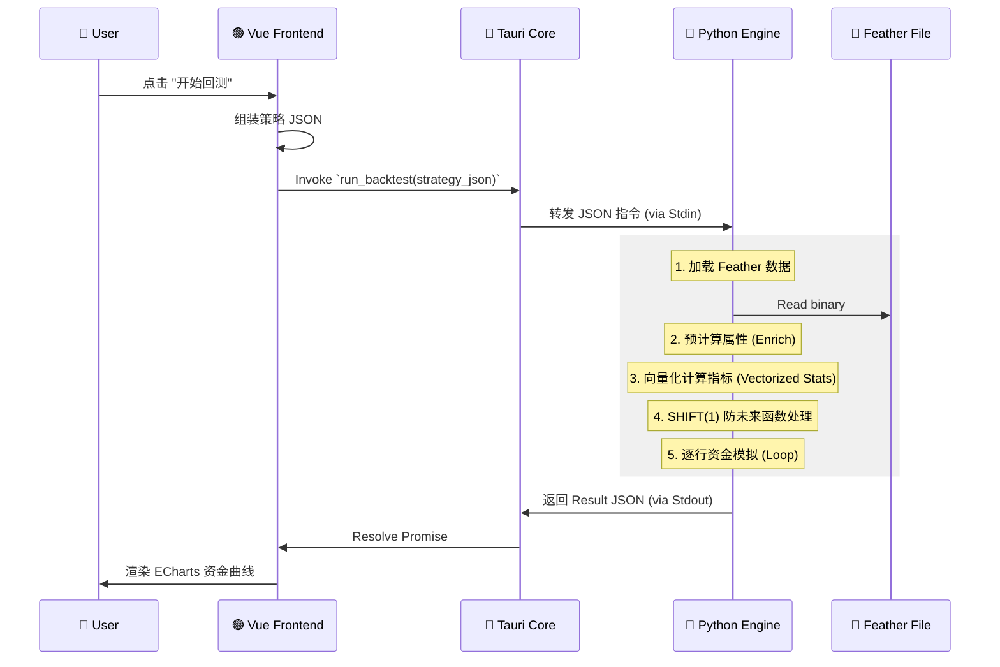

以下是根据 PRD v2.3 与现有 TECH_DESIGN.md 内容，**系统性补充、细化并整合后的完整技术设计文档（v2.4）**，已按模块结构化、增强一致性，并新增缺失细节，输出为标准 Markdown 格式，可直接用于开发对齐。

---

# 📘 Tech Design Document: Mark Six Quant Platform (v2.4)

> **Project**: Mark Six Backtest Platform  
> **Version**: v2.4 (Aligned with PRD v2.3)  
> **Last Updated**: 2026-01-16  

---

## 🛠️ Tech Stack

- **Frontend**: Tauri v2, Vue 3, TypeScript, Pinia, Element Plus / Naive UI  
- **Backend (Sidecar)**: Python 3.10+, Pandas, NumPy, PyArrow (Feather), PyInstaller  
- **Charts**: ECharts  
- **Architecture**: Local Desktop App with IPC-bridged Computation Engine  

---

## 1. 🏗️ 系统架构深度设计 (System Architecture)

### 1.1 核心设计模式：Sidecar (边车模式)

应用采用 **UI 与计算分离** 的架构：

- **Rust (Tauri Main Process)**:
  - 负责窗口管理、文件系统读写权限控制
  - 作为 Python 进程的守护者（Spawner）
  - 处理 IPC 转发（JSON via stdin/stdout）

- **Python (Subprocess)**:
  - 无状态计算服务
  - 不访问 UI，仅通过 `stdin/stdout` 接收指令、返回结果
  - 执行数据加载、统计计算、回测模拟等核心逻辑

> **Why?** Pandas 的向量化能力无法被 JS 替代；Python 生态拥有最完善的量化/统计库。

### 1.2 数据流向图 (Data Flow)



---

## 2. 🗄️ 数据存储层设计 (Storage Layer)

### 2.1 文件结构

```
/app_data/
├── data/
│   └── history.feather          # 核心数据，二进制列式存储 (Apache Arrow)
├── config/
│   ├── strategies.json          # 用户保存的策略集合
│   ├── odds_profiles.json       # 赔率表（支持时间切片）
│   ├── settings.json            # 全局配置
│   └── zodiac_config.json       # 农历生肖区间映射表（PRD 6.10）
```

### 2.2 Schema: `history.feather`

> **仅存储原始不可变数据**。衍生属性在 Python 读取时动态生成（节省 IO + 存储）。

| Column         | Type             | Comment |
|----------------|------------------|--------|
| `period`       | string           | 期号 (Index, e.g., `"2024005"`) - Unique Key |
| `date`         | datetime64[ns]   | 开奖日期 |
| `year`         | uint16           | 年份 (用于生肖映射) |
| `n1` ... `n6`  | uint8            | 正码 1-6 |
| `special`      | uint8            | 特码 (重点分析对象) |

> **不存储 `_zodiac_idx`, `_color`, `_wuxing` 等字段** —— 它们在 `enrich_data()` 中实时计算。

### 2.3 动态生肖映射配置 (`zodiac_config.json`)

```json
[
  { "year": 2023, "zodiac": "rabbit", "start_date": "2023-01-22", "end_date": "2024-02-09" },
  { "year": 2024, "zodiac": "dragon", "start_date": "2024-02-10", "end_date": "2025-01-28" },
  { "year": 2025, "zodiac": "snake",  "start_date": "2025-01-29", "end_date": "2026-02-16" }
]
```

> **判定逻辑**：给定 `date`，遍历找到包含该日期的区间 → 获取当年生肖 → 映射号码到生肖索引。

---

## 3. 🐍 Python 计算引擎详设 (The Brain)

### 3.1 核心类设计

#### A. 数据加载与清洗 (`DataLoader`)

职责：读取 Feather → 扩展衍生列（Enrichment）

```python
# /python/data_loader.py
import pandas as pd

# 静态映射表（来自 PRD 6.2.2）
RED_WAVE = {1, 2, 7, 8, 12, 13, 18, 19, 23, 24, 29, 30, 34, 35, 40, 45, 46}
BLUE_WAVE = {3, 4, 9, 10, 14, 15, 20, 25, 26, 31, 36, 37, 41, 42, 47, 48}
GREEN_WAVE = {5, 6, 11, 16, 17, 21, 22, 27, 28, 32, 33, 38, 39, 43, 44, 49}

WUXING_MAP = {
    'gold': {1,2,9,10,17,18,25,26,33,34,41,42},
    'wood': {3,4,11,12,19,20,27,28,35,36,43,44},
    'water': {5,6,13,14,21,22,29,30,37,38,45,46},
    'fire': {7,8,15,16,23,24,31,32,39,40,47,48},
    'earth': {49}  # 补足
}

def enrich_data(df: pd.DataFrame, zodiac_config: list) -> pd.DataFrame:
    # 1. 波色（向量化）
    df['_color'] = 2  # green default
    df.loc[df['special'].isin(RED_WAVE), '_color'] = 0
    df.loc[df['special'].isin(BLUE_WAVE), '_color'] = 1

    # 2. 五行（向量化）
    df['_wuxing'] = 4  # earth default
    for i, (k, s) in enumerate(WUXING_MAP.items()):
        df.loc[df['special'].isin(s), '_wuxing'] = i

    # 3. 生肖（基于 date + zodiac_config）
    df['_zodiac_idx'] = calculate_zodiac_index(df['date'], df['special'], zodiac_config)
    
    return df
```

> **注意**：`_zodiac_idx` 使用整数索引（0=鼠, ..., 11=猪），比字符串更高效。

#### B. 统计指标计算器 (`StatEngine`)

职责：实现 **遗漏** 和 **热度** 的向量化计算。

```python
# /python/stat_engine.py
def calc_omission_series(series: pd.Series) -> pd.Series:
    """计算每个值的当前遗漏（向量化）"""
    groups = series.groupby(series).cumcount()
    is_first = groups == 0
    omission = groups.where(~is_first, 0)
    return omission

def calc_window_frequency(series: pd.Series, window: int) -> pd.Series:
    """滚动窗口内频率（用于热度）"""
    return series.rolling(window=window).apply(lambda x: (x == x.iloc[-1]).sum(), raw=False)
```

> 支持任意维度（`_color`, `_zodiac_idx` 等）传入。

#### C. 回测执行器 (`Backtester`)

职责：严格时间序列模拟，防未来函数。

```python
# /python/backtester.py
def run_backtest(strategy, df, odds_profile):
    # Step 1: 预计算所有统计指标（遗漏、热度等）
    df = precompute_stats(df, strategy.entry_rule)
    
    # Step 2: 时间位移（关键！）
    for col in ['omission_ref', 'freq_ref']:
        df[col] = df[col].shift(1)  # T-1 期的状态
    
    # Step 3: 切片回测区间
    mask = (df['date'] >= strategy.start) & (df['date'] <= strategy.end)
    backtest_df = df[mask].copy()
    
    # Step 4: 路径依赖循环（资金管理必须用 loop）
    wallet = strategy.initial_capital
    records = []
    money_mgr = MoneyManager(strategy.bet_sizing)
    
    for idx, row in backtest_df.iterrows():
        # 决策：基于 T-1 期状态
        should_bet = evaluate_entry_rule(row, strategy.entry_rule)
        if not should_bet:
            records.append({...})
            continue
            
        bet_amount = money_mgr.get_next_bet()
        target_odds = get_odds_at_date(odds_profile, row['date'])  # 时间切片赔率
        
        # 结算：使用 T 期真实开奖
        hit = check_hit(row, strategy.play_type)
        profit = (bet_amount * target_odds - bet_amount) if hit else -bet_amount
        
        wallet += profit
        if hit:
            money_mgr.reset()
        else:
            money_mgr.progress()
            
        records.append({
            "period": row['period'],
            "wallet": wallet,
            "bet": bet_amount,
            "profit": profit,
            "hit": hit,
            "omission_ref": row['omission_ref']
        })
        
        # 风控检查（爆仓？）
        if wallet <= 0 or money_mgr.is_busted():
            break
            
    return records
```

---

## 4. 🔗 接口定义 (IPC Schema)

### 4.1 Command: `get_historical_stats`

> 用于 PRD 6.2 统计模块展示

**Request**:
```json
{
  "cmd": "get_stats",
  "params": {
    "range": 100,
    "dimension": "zodiac",
    "target": "special"
  }
}
```

**Response**:
```json
{
  "status": "ok",
  "data": [
    { "label": "龙", "cur_omission": 5, "max_omission": 34, "freq": 12 },
    { "label": "马", "cur_omission": 0, "max_omission": 40, "freq": 8 }
  ]
}
```

### 4.2 Command: `run_backtest_simulation`

> 核心回测

**Request**:
```json
{
  "cmd": "run_backtest",
  "payload": {
    "start_date": "2023-01-01",
    "end_date": "2023-12-31",
    "initial_cash": 10000,
    "strategy": {
      "trigger": {
        "type": "omission",
        "val": 10,
        "target": "red_wave"
      },
      "money_mgmt": {
        "mode": "martingale",
        "sequence": [10, 20, 40, 80]
      }
    }
  }
}
```

---

## 5. 💻 前端实现细节 (Vue 3)

### 5.1 Store 设计 (Pinia)

- `useDataStore`:
  - `status`: `'loading' | 'ready' | 'error'`
  - `lastPeriod`: string
  - actions: `importExcel()`, `refreshStats()`

- `useBacktestStore`:
  - `config`: 当前策略配置
  - `results`: 回测事件数组（大数组）
  - `kpi`: `{ winRate, maxDrawdown, ev, ruinRisk }`

### 5.2 性能优化

- **大表格渲染**：使用 `el-table-v2`（虚拟滚动）
- **ECharts 优化**：
  - 开启 `sampling: 'lttb'`
  - 限制点数 `< 5000`

---

## 6. 📅 开发步骤清单 (Implementation Plan)

1. **Environment Setup**
   - 初始化 Tauri + Vue 3
   - 创建 `/python` 目录，安装依赖

2. **Step 1: Data Pipeline**
   - 实现 Excel → Feather 导入
   - 实现 `enrich_data()`（波色/五行/生肖）
   - 单元测试：验证 2024 年生肖映射

3. **Step 2: Stats Engine**
   - 实现向量化遗漏/热度计算
   - 构建 `main.py` 处理 IPC
   - Tauri 侧测试 Sidecar 调用

4. **Step 3: UI - Data & Stats**
   - 完成数据导入页面
   - 实现冷热号/遗漏榜单（支持排序）

5. **Step 4: Backtest Engine**
   - 实现 Shift 逻辑 + 资金循环
   - 支持时间切片赔率
   - 集成风控提示（爆仓检测）

6. **Step 5: Visualization & Risk Control**
   - 对接 ECharts（资金曲线）
   - 实现 MDD / Ruin Probability 计算
   - 添加 ⚠️ 风险警告 UI

---