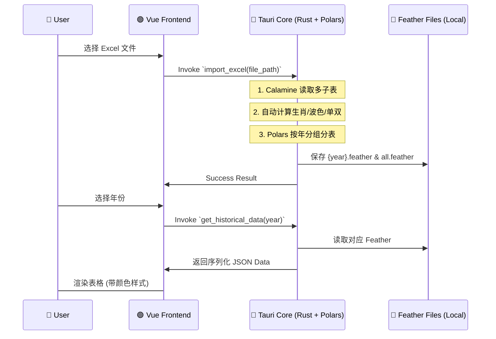

Frontend: Tauri v2, Vue 3, TypeScript, Pinia, Element Plus
Backend (Core): Rust (Native), Polars (Data Processing), Calamine (Excel)
Backend (Sidecar - Future): Python (for complex ML/Advanced Backtesting)
Charts: ECharts
Architecture: Hybrid Rust/Python local desktop app
1. 🏗️ 系统架构深度设计 (System Architecture)

1.1 核心设计模式：UI 与 Native 计算结合
应用采用 Tauri v2 框架。
- **Frontend (Vue 3)**: 负责界面交互、状态管理 (Pinia) 和 ECharts 可视化。
- **Native Core (Rust)**: 
    - 使用 `polars` 进行向量化数据处理 and Feather 读写。
    - 使用 `calamine` 高效读取 Excel 文件。
    - 处理高并发计算任务（如遗漏值统计、回测引擎）。
- **Python (Optional Sidecar)**: 预留用于未来集成复杂的机器学习模型或第三方量化库。

1.2 数据流向图 (Data Flow)


2. 🗄️ 数据存储层设计 (Storage Layer)

2.1 文件结构 (Project Root)
```plaintext
/data
  /history
    2024.feather      # 按年存储，包含预计算列
    2025.feather
    all.feather       # 全量汇总数据，用于跨年回测
/src-tauri
  /src
    data_manager.rs   # 核心数据管理逻辑 (Native Rust)
```

2.2 Schema: history.feather
在导入时即完成 Enrichment，确保存储的 Feather 包含所有前端展示和统计所需的字段。

| Column | Type | Comment |
| --- | --- | --- |
| `period` | String | 期号 |
| `date` | String | 开奖日期 |
| `n1`~`n6` | Int32 | 正码数字 |
| `n1_zodiac`... | String | 生肖 (根据年份动态计算) |
| `n1_color`... | String | 波色 (red/blue/green) |
| `n1_odd`... | Bool | 单双 (true=单, false=双) |
| `special` | Int32 | 特码 |
| `special_zodiac` | String | 特码生肖 |
| `special_color` | String | 特码波色 |
| `special_odd` | Bool | 特码单双 |

3. 🧪 核心逻辑实现 (Rust Core)

3.1 数据处理器 (Data Manager)
- **生肖计算**: `(number - 1) % 12` 映射到固定生肖数组。
- **波色映射**: 内置红/蓝/绿号码池进行 `contains` 判定。
- **Polars 运用**: 
    - 使用 `df!` 宏快速构建数据集。
    - 使用 `IpcWriter`/`IpcReader` 进行高效二进制存储方案。
    - 使用 `unique_stable` 和 `sort` 进行全量数据去重与排序。

4. 🔗 接口定义 (Tauri Invoke Commands)

4.1 `import_excel(file_path)` 
读取 Excel，解析所有子表，计算字段并存入 `/data/history/*.feather`。

4.2 `get_historical_years()`
扫描 `/data/history/` 目录，返回所有已存在的年份列表。

4.3 `get_historical_data(year?)`
读取指定年份的 Feather 文件。若 `year` 为空或为 "全部"，则读取 `all.feather`。

5. 💻 前端实现细节 (Vue 3)

5.1 UI 组件
- **DataManagement.vue**: 使用 `el-table` 展示数据。
- **自定义样式**: 数字显示在实心/镂空圆圈中 (border-color 区分波色)，文字信息 (生肖/单双) 显示在侧边。
- **动态加载**: 切换年份下拉框触发 `get_historical_data` 调用。

6. 📅 开发步骤清单 (Current Progress)
- [x] Step 1: 基础 Tauri + Vue 搭建
- [x] Step 2: Rust 侧 Excel 导入逻辑 (Calamine + Polars)
- [x] Step 3: 数据年份分组与全量汇总存储
- [x] Step 4: 前端数据展示与样式美化 (生肖/波色/单双)
- [ ] Step 5: 统计分析引擎 (遗漏值计算)
- [ ] Step 6: 回测引擎与资金模拟
